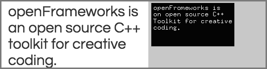
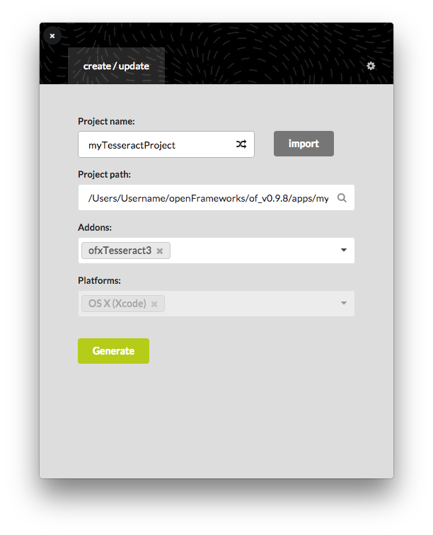
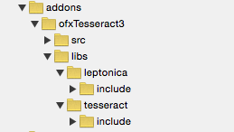
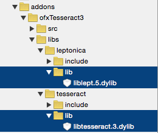
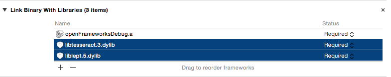

# ofxTesseract3 is an addon for openFrameworks that provides access to the Tesseract OCR library v3.0

  
Original source is [kylemcdonald/ofxTesseract](https://github.com/kylemcdonald/ofxTesseract).

## Generate Project
  
  
Open in Xcode  
  
  
Drag & Drop `libs/leptonica/lib` and `libs/tesseract/lib` to Navigator from Finder  
  
  
Drag & Drop `libtesseract.3.dylib` and `liblept.5.dylib` to `Project > Build Phases > Link Binary With Libraries` from Navigator  
  
  
Finally, You Need to copy the traineddata what you want to use  
  
`[lang].traineddata`  
  
to   `data/tessdata`  
from `ofxTessarect/libs/tesseract/copy_to_data_folder/tessdata`  
  
There are only `eng`, `jpn` and `osd` data.
If you want other languages, please download from [here](https://github.com/tesseract-ocr/tesseract/wiki/Data-Files#data-files-for-version-304305).  